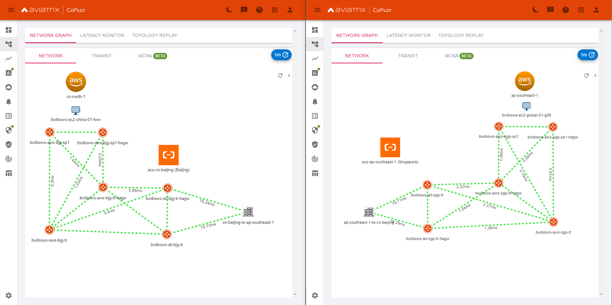

# Aviatrix Cross-Border Network Solution with Alibaba Cloud Enterprise Network (CEN)

This repository provides a Terraform implementation that deploys Aviatrix Cross-Border Network Solution leveraging Alibaba Cloud Enterprise Network (CEN).
The code provided is for demo purposes only.

_Thanks to Przemek https://sky-with-many-clouds.com/ for sharing his TF code https://github.com/conip/CEN-backbone_



## Prerequisites

Please make sure you have:
- 1x Aviatrix Controller 6.7 in China Region
- 1x Aviatrix Controller 6.7 in Global Region (Non-China Region)
- Alibaba Cloud access accounts for Aviatrix are onboarded
- Alibaba Cloud Access and Secret Key
- AWS China and AWS Global Access and Secret Key with named profiles created in AWS CLI

Region 1 = China region
Region 2 = Global (Non-China) region

To run this project, you will need to edit the terraform.tfvars file according to your environment

## Provider configuration

For AWS accounts, the providers are set to look for named profile aws-china-account and aws-account as follows

```
[aws-china-account]
aws_access_key_id = A1B2C3D4E5
aws_secret_access_key = 5e4d3c2b1a0j9i8g7g5f

[aws-account]
aws_access_key_id = F6G7G8I9J0
aws_secret_access_key = 0j9i8g7g5f5e4d3c2b1a
```

## Run Locally

Clone the project

```bash
git clone https://github.com/bayupw/terraform-aviatrix-alicloud-cen-xborder
```

Go to the project directory

```bash
cd terraform-aviatrix-alicloud-cen-xborder
```

Update the terraform.tfvars file

Terraform workflow

```bash
terraform init
terraform plan
terraform apply -auto-approve
```